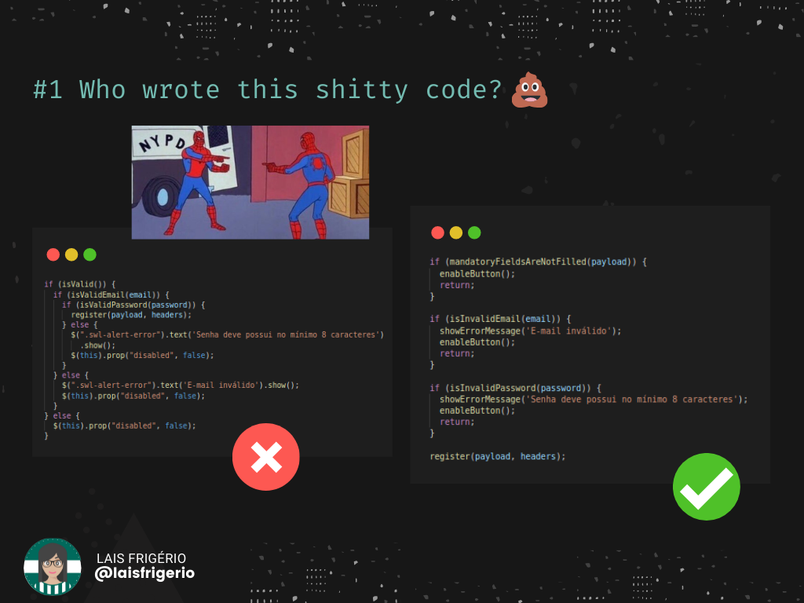
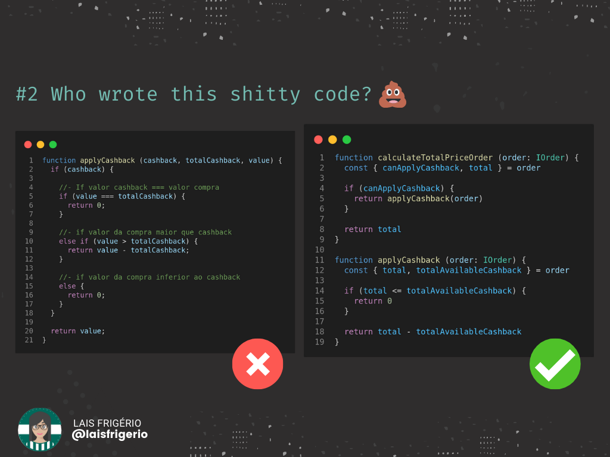
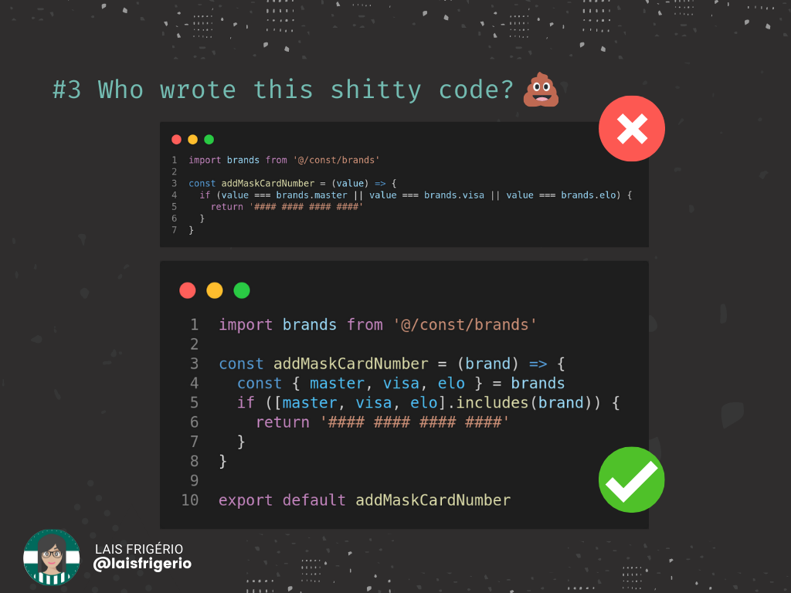
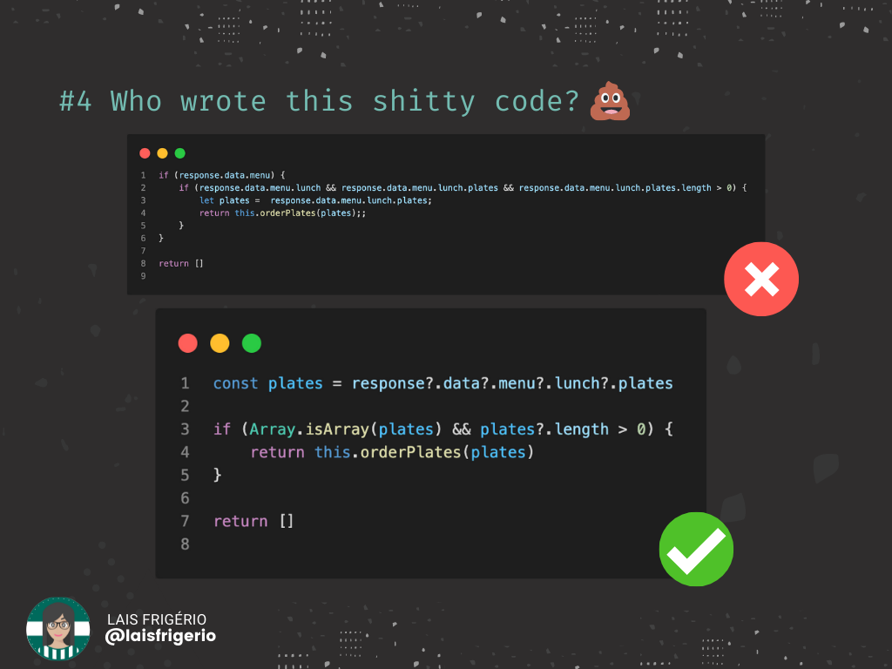
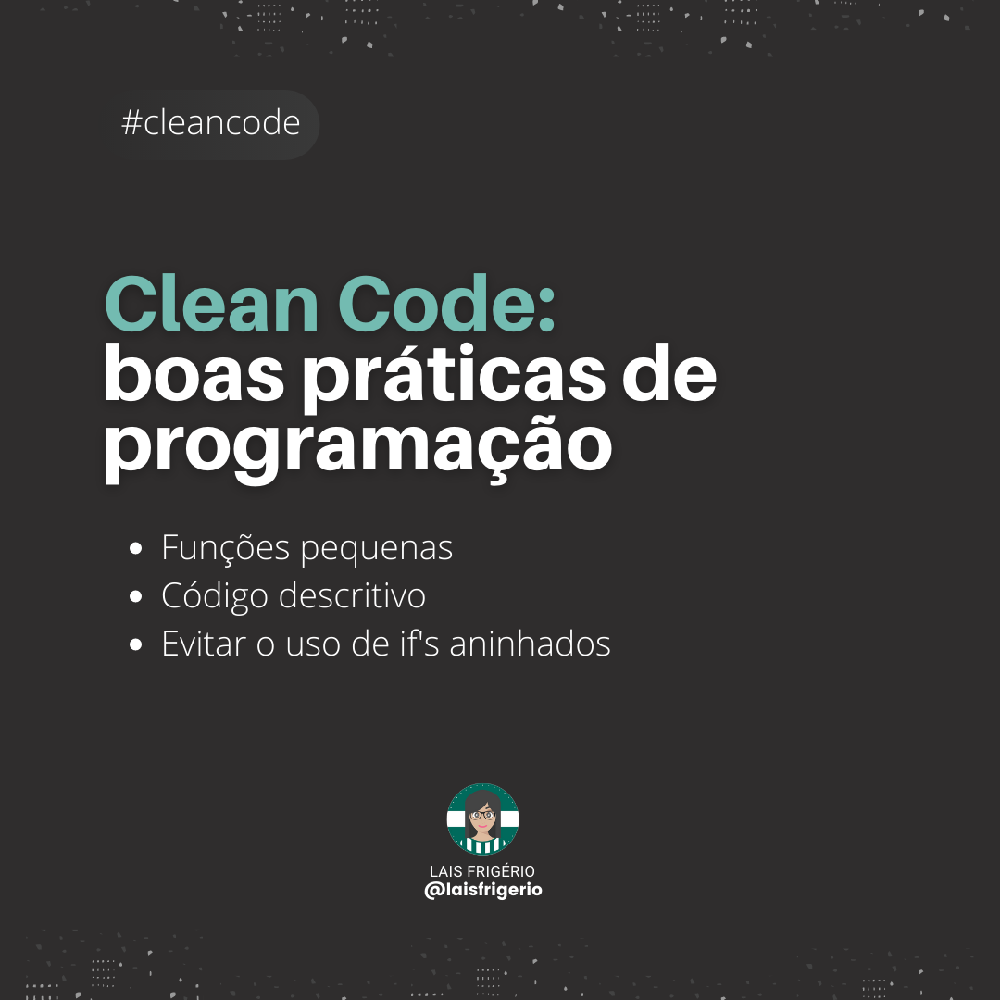
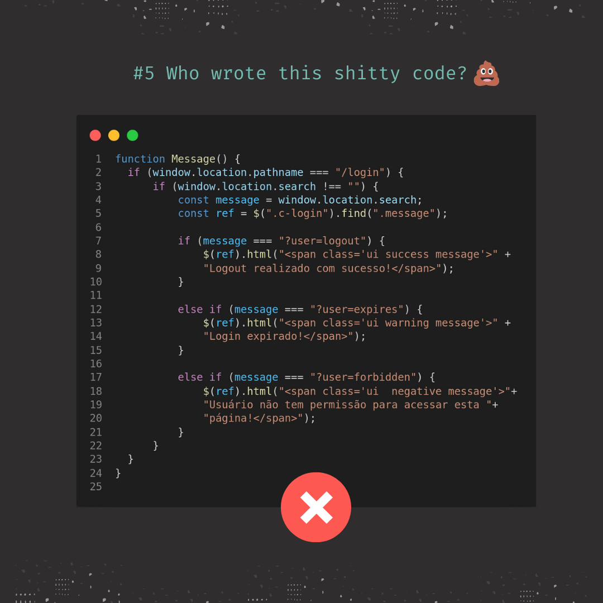
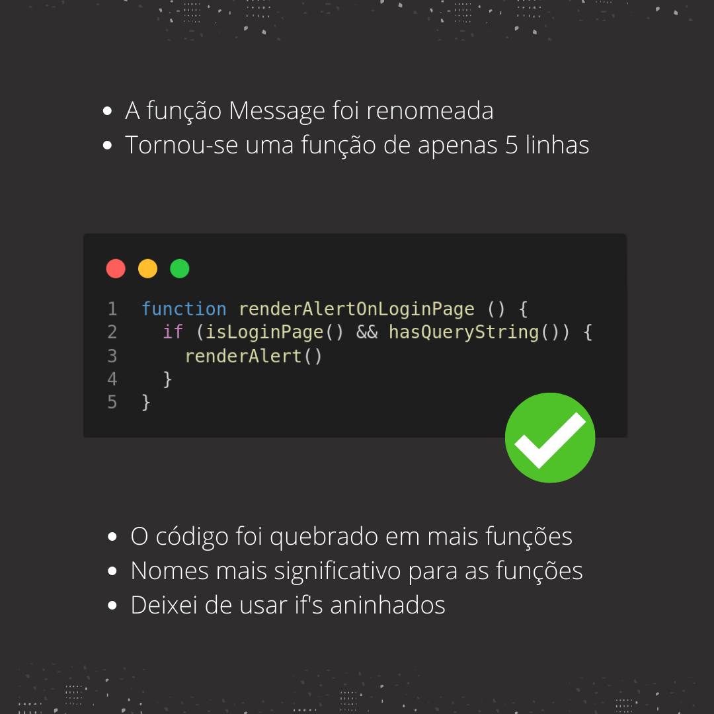
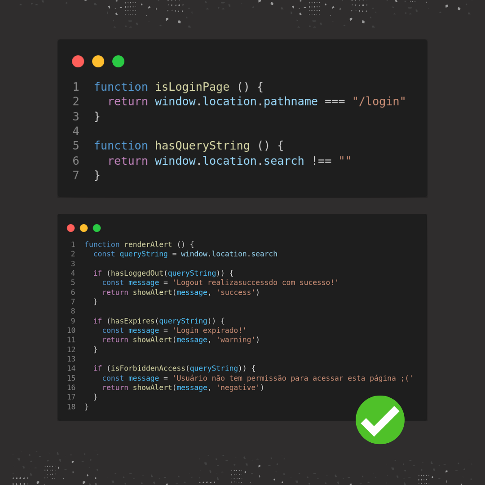
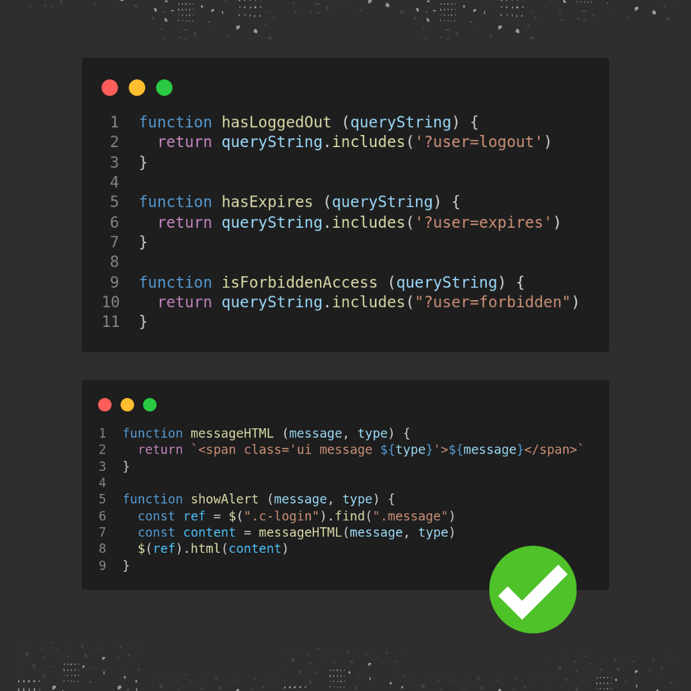

# 💩 Who wrote this shitty code?

Ao encontrar um código antigo me fiz a seguinte pergunta "Quem escreveu este código, meu deus?"

Adivinha quem era a autora? Yes, Baby. Eu mesma.

Então surgiu a ideia de compartilhar trechos de códigos que eu já desenvolvi e mostrar como eu reescreveria atualmente. Demonstrar que com estudos, leituras e, claro, muita prática a evolução vem.

## Example 1

  

**Contexto deste código**: era um formulário de cadastro com nome, e-mail, cpf, telefone e senha. Todos estes campos eram obrigatórios. Desenvolvi a validação do formulário utilizando javascript com jQuery. A validação ocorria toda vez que o usuário pressionava o botão de submit. O botão só ficava desabilitado quando estava ocorrendo a ação de salvar o registro na base de dados.

Pontos de evolução do código que podemos perceber após a refatoração:

- Evitei a estrutura if/else e utilizei o padrão de retorno;
- Evitei a estrutura de if alinhados (um if dentro do outro);
- Evitei usar o operador de negação "!" nas condições (if). Por isso alterei os nomes das funções de validações. Exemplo: `isValidEmail` renomeei para `isInvalidEmail`;
- Utilizei nomes de funções mais descritivas;
- No código da esquerda é possível verificar que o trecho de código para exibir a mensagem de erro está duplicado. A ação de habilitar o botão para clique também está duplicada. Na reescrita optei por criar dois métodos para cada ação: `showErrorMessage` e `enableButton` respectivamente.

## Example 2

  

Podemos dizer que "Clean Code" é a arte de dar significado ao seu código.

Uma das inúmeras maneiras é nomear as funções e variáveis adequadamente para dar mais clareza para o propósito do seu código.

Alguns outros pontos de melhorias que é possível observar:

- Uso de objetos como parâmetro de função ao invés de N argumentos;
- Não uso de if aninhados (um if dentro de outro)
- Não uso da estrutura else-if, else
- Padrão de retorno inicial

Além disso, sempre tirar o que de melhor que a linguagem de programação usada fornece. Ex: Desestruturação, interface

Acredito que a Lais do futuro vai conseguir olhar esse trecho e torná-lo ainda melhor. Mas por ora é essa evolução que consigo evidenciar.

## Example 3

  

🤔 A 4 meses atrás eu comecei a publicar conteúdo no Linkedin.

💡Meu foco desde de então é trazer ideias de como tornar nosso código mais legível, de fácil entendimento, utilizando boas práticas da linguagem.

Acontece que essa evolução é constante. Por exemplo, este código "ruim", eu escrevi a mais ou menos 5 meses atrás, ou seja, bem recente.

E ontem (25/10/2021) eu estava revendo este trecho e identifiquei que era possível melhorá-lo.

✔️ Veja que no primeiro trecho de código a minha condição (if) está relativamente grande. Ao utilizar a função includes, eu diminuí a quantidade de condições OR (que poderiam evoluir e tornar essa condição ainda maior).

🚀 Assim, é sempre importante estudar a linguagem de programação e usar o melhor que ela pode nos oferecer.

❗ Para mais informações sobre o método includes: [Documentação](https://developer.mozilla.org/pt-BR/docs/Web/JavaScript/Reference/Global_Objects/Array/includes)

## Example 4

  

💡 Você provavelmente já escreveu um código e depois de um tempo ao revê-lo percebeu o qual ruim estava, certo?

Se isso aconteceu e/ou ainda acontece é um bom sinal: você está evoluindo sua capacidade de programação.

E é justamente esta a intenção do post: mostrar como eu desenvolvi e como reescreveria o mesmo trecho de código.

O conteúdo de hoje faz parte do "quarto episódio" da série "Who wrote this shitty code".

E, a partir da imagem, conseguimos fazer as seguintes pontuações:

👉  Evitar o uso de ifs alinhados diminui a complexidade do código;

👉  Evitar escrever um trecho de código com mais de 80 caracteres em uma linha. O ideal é sempre o trecho de código estar visível sem a necessidade de scroll lateral;

👉  Estude/acompanhe as features da linguagem de programação e use o que de melhor ela pode nos oferecer. Neste exemplo, eu usei o recurso Operador de encadeamento opcional. O seu uso faz com que não seja necessário verificar cada referência, resultando em expressões mais curtas e simples.

❗ Leia mais sobre o operador de encadeamento opcional [aqui](https://lnkd.in/d843vMyj)

Se gostou, deixe seu starzinho ⭐ aqui repositório!!

📷 Para mais conteúdo, segue meu insta: https://lnkd.in/d6Bxw4HV

## Example 5

  

  

  

  

  

## :woman: Author

| [ <b>@laisfrigerio</b>](https://github.com/laisfrigerio)  |
| :---: |

## 📄 License

This project is licensed under the MIT License - see the LICENSE.md file for details