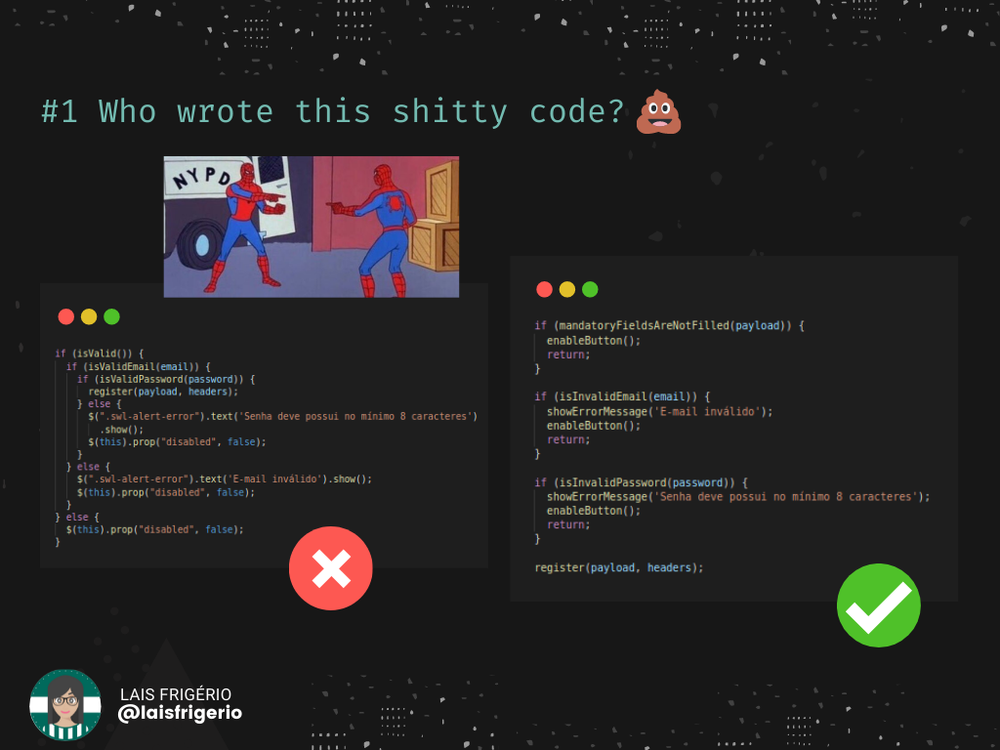
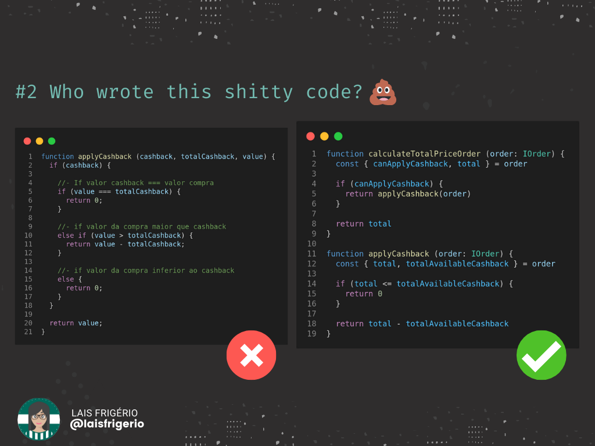

# 💩 Who wrote this shitty code?

Ao encontrar um código antigo me fiz a seguinte pergunta "Quem escreveu este código, meu deus?"

Adivinha quem era a autora? Yes, Baby. Eu mesma.

Então surgiu a ideia de compartilhar trechos de códigos que eu já desenvolvi e mostrar como eu reescreveria atualmente. Demonstrar que com estudos, leituras e, claro, muita prática a evolução vem.

## Example 1

  

**Contexto deste código**: era um formulário de cadastro com nome, e-mail, cpf, telefone e senha. Todos estes campos eram obrigatórios. Desenvolvi a validação do formulário utilizando javascript com jQuery. A validação ocorria toda vez que o usuário pressionava o botão de submit. O botão só ficava desabilitado quando estava ocorrendo a ação de salvar o registro na base de dados.

Pontos de evolução do código que podemos perceber após a refatoração:

- Evitei a estrutura if/else e utilizei o padrão de retorno;
- Evitei a estrutura de if alinhados (um if dentro do outro);
- Evitei usar o operador de negação "!" nas condições (if). Por isso alterei os nomes das funções de validações. Exemplo: `isValidEmail` renomeei para `isInvalidEmail`;
- Utilizei nomes de funções mais descritivas;
- No código da esquerda é possível verificar que o trecho de código para exibir a mensagem de erro está duplicado. A ação de habilitar o botão para clique também está duplicada. Na reescrita optei por criar dois métodos para cada ação: `showErrorMessage` e `enableButton` respectivamente.

## Example 2

  

Podemos dizer que "Clean Code" é a arte de dar significado ao seu código.

Uma das inúmeras maneiras é nomear as funções e variáveis adequadamente para dar mais clareza para o propósito do seu código.

Alguns outros pontos de melhorias que é possível observar:

- Uso de objetos como parâmetro de função ao invés de N argumentos;
- Não uso de if aninhados (um if dentro de outro)
- Não uso da estrutura else-if, else
- Padrão de retorno inicial

Além disso, sempre tirar o que de melhor que a linguagem de programação usada fornece. Ex: Desestruturação, interface

Acredito que a Lais do futuro vai conseguir olhar esse trecho e torná-lo ainda melhor. Mas por ora é essa evolução que consigo evidenciar.

## :woman: Author

| [ <b>@laisfrigerio</b>](https://github.com/laisfrigerio)  |
| :---: |

## 📄 License

This project is licensed under the MIT License - see the LICENSE.md file for details